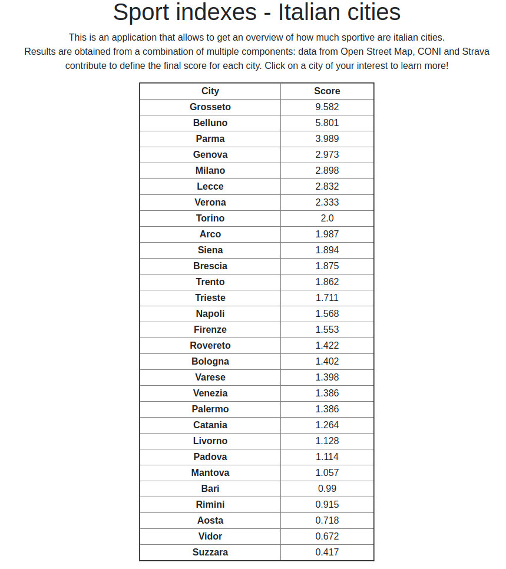
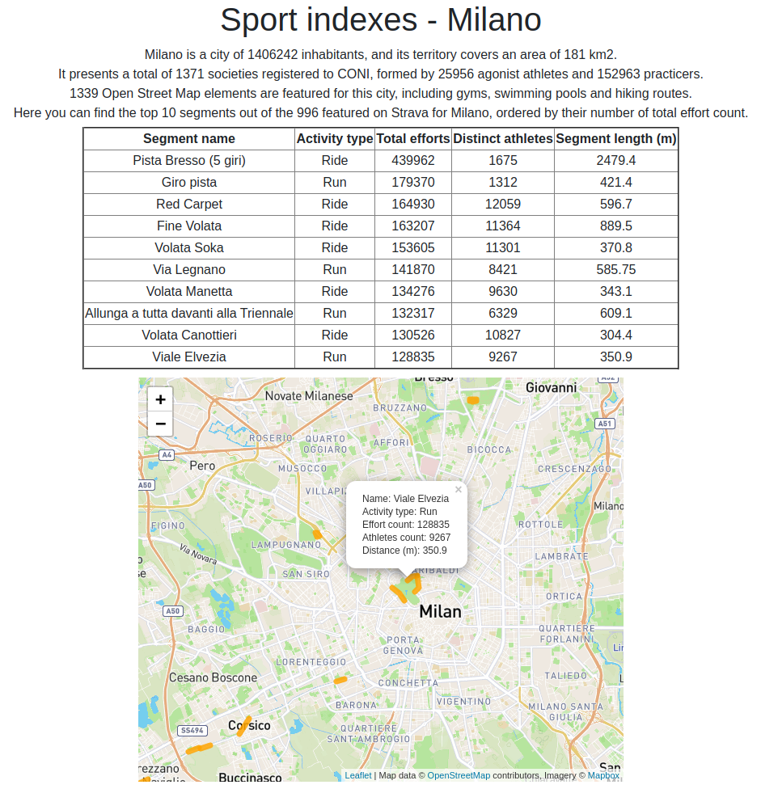

# Presentation

## Usage

To run the application (debug mode is active by default), type:

```python3 flask/app.py```

from root directory. Users can see the results of the computation at ```https://localhost:5000/``` and select any available city by clicking on it to get additional information (available at ```http://localhost:5000/{city}```).  

**NB:** AttributeErrors may be retrieved when executing the script. This is a known issue related to decoding data from Redis, but it doesn't affect in any way data integrity and visualization.

### Directories
* Templates: contains the template displayed in the webapp
* Data: contains the GeoJSON files for the Top10 segments for each city. They are generated during the analysis. Do not change the path.

## Results

The following is the landing page that shows the results of the analysis.



These are the detailed results for the city of Milan. Data related to every aspects of the index are displayed, along with details and localization of the top 10 segments for the city.


